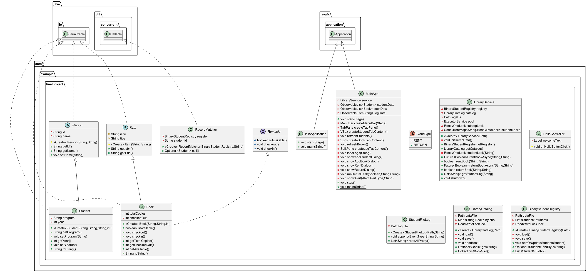

# Campus Library Management System (CLMS)

A multithreaded, JavaFX-based library management system designed for a campus environment.  
The application manages student records, book catalogs, rentals and returns, and per-student log histories using binary file I/O.  
This project demonstrates object-oriented design, binary persistence, thread-safe operations, and a responsive JavaFX interface.

---

## Key Features

### **Student Record Management**
- Add, search, and list students  
- Records stored in `students.dat` using binary serialization  
- Uses in-memory indexing for efficient lookups  

### **Book Catalog Management**
- Add books and view all books  
- Tracks available and checked-out copies  
- Persisted to `catalog.dat`  

### **Rent and Return System**
- Students rent books through threaded record matching  
- Logs stored per student in `logs/<studentId>.dat`  
- Each log entry includes:
  - timestamp  
  - event type (`RENT` or `RETURN`)  
  - ISBN  
  - book title  

### **Multithreading and Synchronization**
- Uses `ExecutorService` for concurrent lookups  
- JavaFX `Task` keeps the UI responsive  
- `ReentrantReadWriteLock` ensures thread-safe file access  

### **JavaFX Interface**
- Menu bar: **Students**, **Books**, **Rentals**, **Exit**  
- `TabPane` containing:
  - Student Records  
  - Book Catalog  
  - Student Logs  
- Split pane: Students on the left, logs on the right  
- UI updates automatically after rent/return actions  

---

## System Architecture

### UML Diagram

### **Core Classes**
- `Person`
- `Student`
- `Item`
- `Book` (implements `Rentable`)
- Optional:
  - `ReferenceBook`
  - `EBook`

### **Storage and Service Classes**
- `BinaryStudentRegistry`
- `LibraryCatalog`
- `StudentFileLog`
- `RecordMatcher`
- `LibraryService`

All data uses binary formats with proper framing and thread-safe locking.

---

## Technologies Used
- **Java 17+**
- **JavaFX 17+**
- **ExecutorService**
- **ReentrantReadWriteLock**
- **Binary File I/O**  
  (`ObjectOutputStream`, `RandomAccessFile`, `DataOutputStream`)
